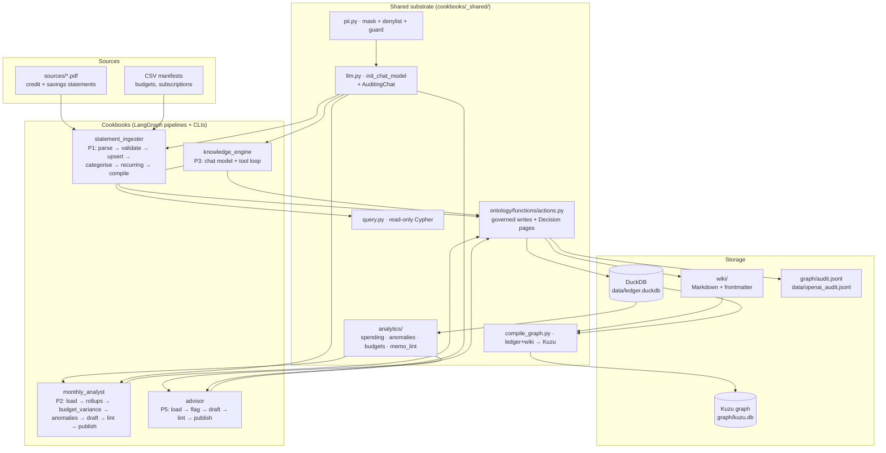
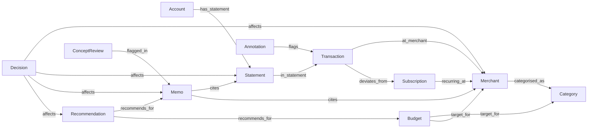
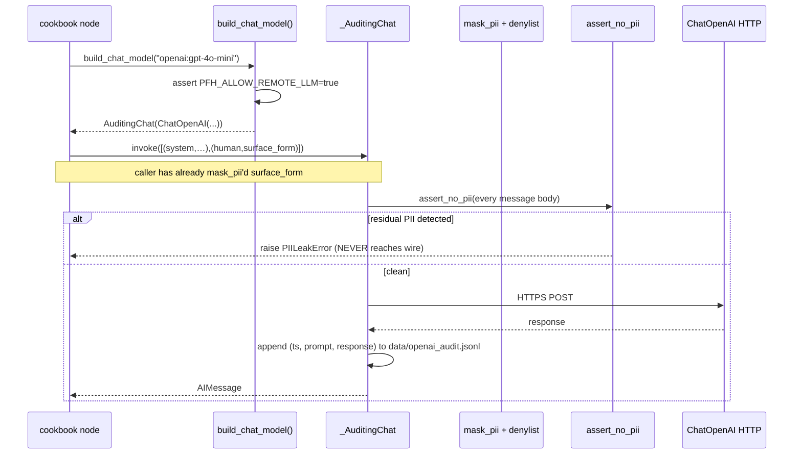

# Architecture

This document explains how the personal-finance-helper system is built
and how data flows from a PDF statement to a published recommendation.

## TL;DR

The system is a **layered Python application** with four cookbooks
sitting on a shared substrate. Every persistent write goes through the
**action layer**, which transparently emits a `Decision` wiki page
alongside its primary effect — making every state change auditable and
replayable. Privacy is enforced by gating remote LLM calls behind an
explicit env flag plus a regex-and-denylist masker plus a hard-fail
guard. The frontend surface is pure CLI + Markdown (Obsidian-renderable);
no web UI yet.

## High-level component diagram



## Layered model

```
┌──────────────────────────────────────────────────────────────┐
│ Cookbooks (4): statement_ingester, monthly_analyst,          │  ← Each is a LangGraph
│                advisor, knowledge_engine                      │     StateGraph + Typer CLI
├──────────────────────────────────────────────────────────────┤
│ Action layer (cookbooks/_shared/ontology/functions/           │  ← Only place that
│ actions.py): upsert_*, publish_*, merge_*, set_budget,        │     writes (DB+wiki+audit)
│ flag_concept_review                                           │
├──────────────────────────────────────────────────────────────┤
│ Analytics primitives (cookbooks/_shared/analytics/):          │  ← Pure read functions
│ spending · anomalies · budgets · memo_lint                    │     over DuckDB
├──────────────────────────────────────────────────────────────┤
│ LLM substrate (cookbooks/_shared/llm.py):                     │  ← One factory; one
│ build_chat_model · AuditingChat · PII masker · denylist       │     wire boundary
├──────────────────────────────────────────────────────────────┤
│ Storage (cookbooks/_shared/db.py + compile_graph.py):         │  ← Three coupled stores;
│ DuckDB ledger · Wiki Markdown · Kuzu graph                    │     wiki = source of
│                                                                │     truth for ontology
└──────────────────────────────────────────────────────────────┘
```

Lower layers don't import upper layers. Upper layers compose lower
layers' APIs — never their internals.

## The three coupled stores

| Store | Format | Role | Source of truth |
|---|---|---|---|
| **DuckDB** (`data/ledger.duckdb`) | Relational, ACID | Transaction-level numbers, FK-enforced | numerics ✓ |
| **Wiki** (`wiki/**.md`) | Markdown + YAML frontmatter | Human-readable + Obsidian-graphable; the canonical state of any *entity* (merchant, statement, memo, decision, etc.) | entities ✓ |
| **Kuzu graph** (`graph/kuzu.db`) | Property graph (Cypher) | Compiled view used by Q&A. Always derivable from DuckDB + Wiki. | derived ✗ |

`compile_graph.py` projects DuckDB rows + Wiki frontmatter into Kuzu;
its idempotency fingerprint short-circuits when nothing has changed.

The wiki is the **canonical entity store** because it's
human-editable (Obsidian, plain text), version-controllable, and has
back-link semantics for free. Numerics live in DuckDB because Markdown
is the wrong place for million-row sums.

## Ontology

Defined in `cookbooks/_shared/ontology/*.yaml`, loaded by
`loader.py` into typed Pydantic models.



11 ObjectTypes · 17 link types · 10 action types. The link-type
catalogue gives every cookbook a vocabulary it can express its writes
through.

## Action layer (the audit boundary)

Every persistent write — every wiki page that gets created, every
DuckDB row that gets inserted/updated, every merchant merge — flows
through one of these governed entry points:

| Action | Cookbook | Effect |
|---|---|---|
| `upsert_statement` | statement_ingester | wiki/statements/ + DB statements row |
| `upsert_merchant` | statement_ingester | wiki/merchants/ + DB merchants row + alias union |
| `upsert_subscription` | statement_ingester | wiki/subscriptions/ + DB patterns row |
| `merge_merchant_aliases` | knowledge_engine | re-points transactions, drops source merchant, unions aliases |
| `publish_monthly_memo` | monthly_analyst | wiki/memos/ |
| `publish_recommendation` | advisor | wiki/recommendations/ (deterministic id from sha256(body)) |
| `flag_concept_review` | advisor | wiki/annotations/ with `[[concept]]` back-link |
| `set_budget` | statement_ingester budget CLI / advisor | wiki/budgets/ + DB budgets row |

Every action calls `_audit(...)`, which atomically:

1. Appends a row to `graph/audit.jsonl` (compliance log).
2. **Writes a Decision wiki page** (`wiki/decisions/decision_<action>_<actor>_<ts>.md`)
   with frontmatter (`actor`, `scopes`, `inputs_summary`, `result_summary`,
   `wiki_fingerprint`, `ontology_fingerprint`) and body (full inputs +
   result as JSON, plus an `## Affects` section with `[[wikilinks]]` to
   the touched entity).

This is the **Decision-as-first-class-node** pattern, borrowed from the
`context_graphs` project. It means every state change in the system is
itself a typed entity in the graph — searchable, citable, replayable.

`replay_decision(decision_id)` in `_shared/ontology/functions/replay.py`
reconstructs which wiki + ontology fingerprints were live at the
Decision's `ts` and flags drift.

## Privacy stack

Single boundary: `cookbooks/_shared/llm.py:build_chat_model`. By
default refuses every provider except `ollama` (privacy thesis). When
`PFH_ALLOW_REMOTE_LLM=true`, the `openai` provider is whitelisted and
wrapped in an `_AuditingChat` proxy:



Two layers of defence:

1. **Masker**: regex (sort code, IBAN, postcode, phone, email, 8+ digit
   runs) + configurable denylist (`PFH_PII_DENYLIST` env var) →
   replaced with `[NAME]`/`[NUM]`/etc.
2. **Hard guard**: `assert_no_pii(text)` after masking. Same regex
   patterns; raises `PIILeakError` if any survived. The wire call
   never happens.

Concurrency: `_AuditingChat` has a per-instance `threading.Lock`
around the audit-log write, so the parallel categoriser
(`PFH_CATEGORISE_CONCURRENCY=8`) can't interleave bytes.

## Pipeline shapes

### P1 statement_ingester

```
parse_pdf     ──┐                                                 (cached on sha256)
                ├─→ validate_completeness  (regex scan, warn-only)
upsert_ledger  ─┘
                └─→ categorise         (rules-cache + parallel LLM, PFH_CATEGORISE_CONCURRENCY)
                    ↓
                detect_recurring       (window function over patterns)
                    ↓
                compile_graph          (ledger+wiki → Kuzu, fingerprint-skip)
                    ↓
                report
```

### P2 monthly_analyst

```
load_period → compute_rollups → budget_variance → detect_anomalies
            → draft_memo → lint_memo → publish → report
                       ↘ (errors) ↗
```

`draft_memo` has two modes (env `PFH_MEMO_MODE`):
- `template` (default, deterministic) — Jinja-style fill-in.
- `llm` — chat model polish, preserving every numeric token and
  wikilink (rubric in `monthly_analyst/skills/memo-rubric.md`).

`lint_memo` is the **completeness gate**: every `£X.XX` and `X%` token
in the body must trace to an entry in `state["draft_cited_values"]`.
Hard-fail by default; `PFH_MEMO_LINT_WARN_ONLY=true` to demote.

### P3 knowledge_engine

Hand-rolled chat-model + tool loop. Three tools:

| Tool | Read/write | Refused when `allow_writes=False` |
|---|---|---|
| `query_graph(cypher)` | Read | — |
| `read_wiki_page(page_id)` | Read | — |
| `merge_merchants(src, tgt, reason)` | **Write** | ✓ |

`allow_writes=False` is the default. The CLI exposes a separate
`merge` subcommand for the explicit-approval write path. Cypher is
sandboxed: forbidden keywords (`CREATE`/`MERGE`/`DELETE`/`SET`/
`DROP`/`ALTER`/`REMOVE`/`DETACH`) trigger `QueryRejectedError`, and
results are row-capped via `PFH_QA_ROW_LIMIT`.

### P5 advisor

```
load_context (memo + budgets + findings + merchants)
   ↓
flag_uncertainties (queues ConceptReview for generic merchant names)
   ↓
draft_recommendations (template per kind: subscription_cancel /
                       budget_adjust / anomaly_investigate /
                       category_recategorise)
   ↓
lint_recommendations (reuses memo_lint primitive)
   ↓
publish_recommendations (one publish_recommendation action per draft;
                         deterministic page id from sha256(body))
   ↓
report
```

## Data flow: from PDF to recommendation

End-to-end trace of one statement → one accepted recommendation:

1. PDF lands in `sources/credit/Statement_Apr-25.pdf`.
2. `statement_ingester backfill` parses it via Docling (cached in
   `parsed/`), validates the markdown for completeness, upserts an
   `accounts` row (if new) and a `statements` row keyed on SHA-256.
3. `upsert_ledger` extracts transactions, calls `INSERT OR IGNORE`,
   then for each new merchant raw_description either hits the
   `data/rules.yaml` cache or invokes the LLM categoriser (parallel
   pool of 8). Each `upsert_merchant` call writes a wiki page **and** a
   Decision page.
4. `detect_recurring` runs a window function over `patterns`; for each
   ≥3-occurrence merchant within tolerance, calls `upsert_subscription`.
5. `compile_graph` projects everything to Kuzu (after fingerprint
   check).
6. `monthly_analyst analyse 2025-04` reads the ledger, rolls up
   spending, computes budget variance against `budgets` rows,
   surfaces subscription-drift + merchant-z-score anomalies, drafts a
   memo, lints the body for unsupported numbers, publishes via
   `publish_monthly_memo` → wiki + Decision.
7. `advisor recommend 2025-04` loads the memo, flags low-confidence
   merchants for ConceptReview, drafts recommendations per trigger
   kind, lints, and publishes via `publish_recommendation` → wiki +
   Decision.
8. User runs `advisor accept rec_2025_04_<hash>` — the page's
   frontmatter `status` flips to `accepted` and a follow-up Decision
   captures the human action.

The graph view (Obsidian or `python -m cookbooks.statement_ingester
graph-stats`) shows: **Statement → Transaction → Merchant → Category**
(plus `Memo → Recommendation` and `Decision`-back-links from every
write).

## Concurrency model

| Where | Strategy |
|---|---|
| Categoriser LLM calls | `ThreadPoolExecutor` (`PFH_CATEGORISE_CONCURRENCY`, default 8). Pure I/O — chat models are thread-safe. |
| `_AuditingChat` log writes | `threading.Lock` per instance to avoid interleaved JSONL bytes. |
| DuckDB writes | Serial. DuckDB allows multiple connections but only one writer per process; we open + close per critical section. |
| Wiki writes | Single-threaded today. (Atomic enough at OS level for single writer.) |
| Kuzu graph compile | Single-process; idempotency fingerprint avoids redundant work. |

## What is *not* here

- **No web UI** (React, Next.js, etc.). The frontend question came up
  during planning; v1 is CLI + Obsidian. A future `web/` package would
  read the existing DuckDB + wiki + Kuzu as data sources, optionally
  via a thin FastAPI layer over `cookbooks/_shared/qa_tools.py`.
- **No real-time alerting.** The advisor produces monthly memos +
  recommendations; push notifications are separate infrastructure.
- **No multi-user.** Single-user assumption throughout.
- **No forecasting.** Recommendations are based on observed history,
  not time-series projection.
- **No automatic external writes** (to bank APIs, email, etc.). Every
  write is to local files. The system is observational + advisory.

## Where to extend

| Extension | Where it slots in |
|---|---|
| New ObjectType | `_shared/ontology/object_types.yaml` + a new action in `actions.py` + record-ingester dispatch entry |
| New analyst metric | `_shared/analytics/<name>.py`, then a node in the relevant cookbook |
| New CLI command | The cookbook's `cli.py` (Typer) |
| New advisor recommendation kind | `cookbooks/advisor/nodes/draft_recommendations.py` — add a trigger + template body |
| Web frontend | New `web/` directory; can read DuckDB/wiki/Kuzu directly or via FastAPI shim |
| Different chat provider | `_shared/llm.py:_ALLOWED_REMOTE_PROVIDERS` (privacy gate stays — add the provider explicitly) |

## Testing model

- **315 unit tests**, all using synthetic fixtures (no real PII).
- Each cookbook has `test_<node>.py` for individual nodes,
  `test_graph_e2e.py` for end-to-end pipeline runs, and `test_cli.py`
  for the Typer surface.
- The action layer has dedicated tests for Decision-page emission,
  fingerprint drift, scope checks, and idempotency.
- Real-data integration tests (e.g., `test_real_backfill.py`) are
  opt-in via `PFH_RUN_INTEGRATION=1`.

## Borrowed patterns

Three patterns lifted faithfully from
[`rnd_2026/context_graphs`](https://github.com/cwijayasundara/context_graphs)
during P2/P3:

1. **Decision-as-first-class-node** — every action emits a wiki/decisions
   page atomically with its primary effect.
2. **Manifest-driven Record-path ingester** — declarative non-LLM
   ingestion via `<file>.csv` + `<file>.manifest.yaml`.
3. **Decision replay** — fingerprints captured at audit time enable
   reconstruction of state-of-world later.

PFH's own contributions back: the **PII masker stack + hard guard +
audit log** are unique to this codebase, ported in the other direction
would be an opt-in privacy layer for context_graphs.
